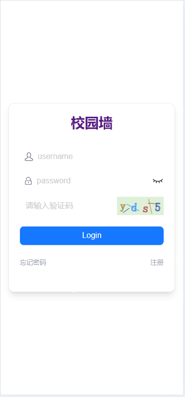
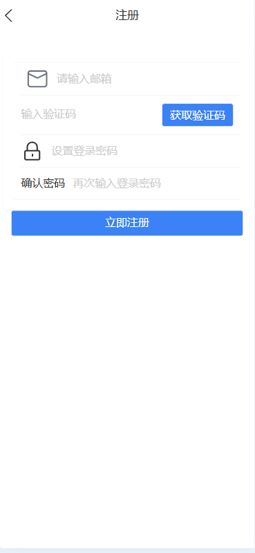
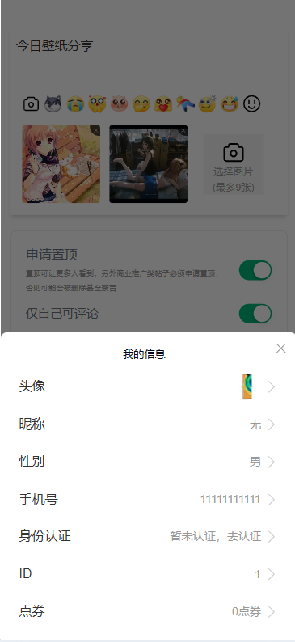
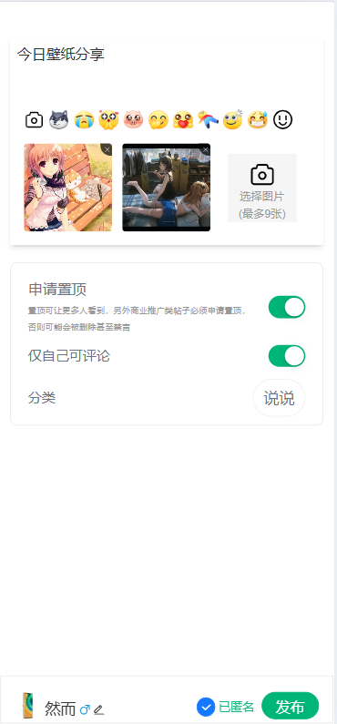
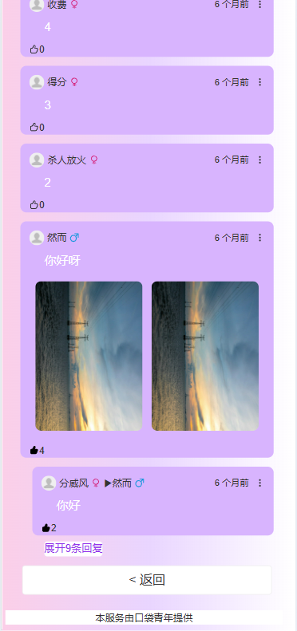
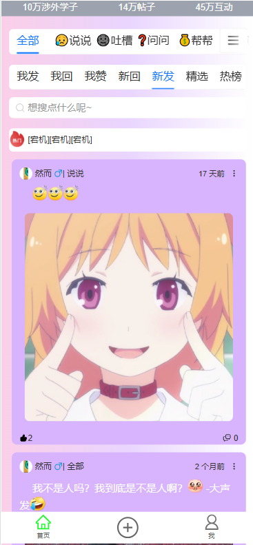
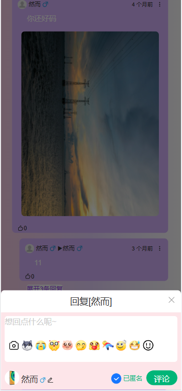
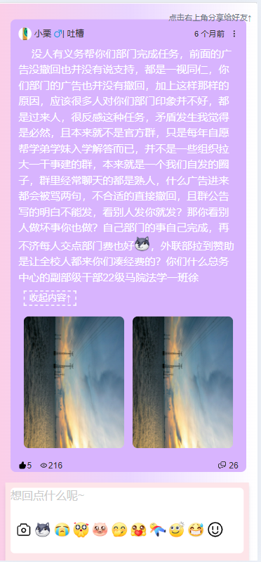

# 校园墙项目

## 项目简介

校园墙是一个的校园社交平台，旨在为大学生提供一个便捷的互动与分享平台。用户可以在墙上发布内容、点赞、评论，并与其他同学互动。该平台响应式设计，适用于各种移动端设备，提供了流畅的用户体验。

该项目基于现代前端技术栈，结合后端技术实现高效的数据管理与交互。

演示 Demo :[校园墙](https://www.flawless.uno/)

## 技术栈

* **前端**
  * React
  * Tailwind CSS
  * Vite
  * Antd Mobile
  * Redux (状态管理)
  * JWT (用户认证)
* **后端**
  * Spring Boot
  * MyBatis Plus
  * Redis (缓存)
  * MySQL (数据库)
  * Oss存储

## 功能展示

* **用户管理**
  * 注册与登录（基于 JWT 实现的认证）

`

* 用户信息查看与修改

* 用户发布内容（文本、图片等）

  
* **内容互动**

  * 发布、点赞、评论动态

    
  * 点赞后，改变颜色

    
  * 回复评论及查看评论详情

    
  * 内容展开和收起

    
* **实时数据**

  * 使用 Redis 存储缓存数据，提升响应速度
  * 动态内容分页加载

## 部署方法

### 1. 后端部署（Spring Boot + MySQL + Redis）

#### 配置数据库

1. 配置 MySQL 数据库
   * 创建数据库 `wall`
   * 配置数据库连接信息
2. 配置 Redis
   * 启动 Redis 服务
   * 配置 `application.properties` 中的 Redis 连接信息

#### 启动 Spring Boot 后端

<pre class="!overflow-visible">

bash

<button class="flex gap-1 items-center select-none py-1"><svg width="24" height="24" viewBox="0 0 24 24" fill="none" xmlns="http://www.w3.org/2000/svg" class="icon-sm"><path fill-rule="evenodd" clip-rule="evenodd" d="M7 5C7 3.34315 8.34315 2 10 2H19C20.6569 2 22 3.34315 22 5V14C22 15.6569 20.6569 17 19 17H17V19C17 20.6569 15.6569 22 14 22H5C3.34315 22 2 20.6569 2 19V10C2 8.34315 3.34315 7 5 7H7V5ZM9 7H14C15.6569 7 17 8.34315 17 10V15H19C19.5523 15 20 14.5523 20 14V5C20 4.44772 19.5523 4 19 4H10C9.44772 4 9 4.44772 9 5V7ZM5 9C4.44772 9 4 9.44772 4 10V19C4 19.5523 4.44772 20 5 20H14C14.5523 20 15 19.5523 15 19V10C15 9.44772 14.5523 9 14 9H5Z" fill="currentColor"></path></svg>复制代码</button>

<code class="!whitespace-pre hljs language-bash"># 克隆后端仓库
git clone https://gitee.com/LH__04/wall-a.git
cd 

# 打包并运行
mvn clean install
java -jar target/campus-wall-backend.jar
</code>

</pre>

### 2. 前端部署（React + Vite）

1. 安装依赖

<pre class="!overflow-visible">

bash

<button class="flex gap-1 items-center select-none py-1"><svg width="24" height="24" viewBox="0 0 24 24" fill="none" xmlns="http://www.w3.org/2000/svg" class="icon-sm"><path fill-rule="evenodd" clip-rule="evenodd" d="M7 5C7 3.34315 8.34315 2 10 2H19C20.6569 2 22 3.34315 22 5V14C22 15.6569 20.6569 17 19 17H17V19C17 20.6569 15.6569 22 14 22H5C3.34315 22 2 20.6569 2 19V10C2 8.34315 3.34315 7 5 7H7V5ZM9 7H14C15.6569 7 17 8.34315 17 10V15H19C19.5523 15 20 14.5523 20 14V5C20 4.44772 19.5523 4 19 4H10C9.44772 4 9 4.44772 9 5V7ZM5 9C4.44772 9 4 9.44772 4 10V19C4 19.5523 4.44772 20 5 20H14C14.5523 20 15 19.5523 15 19V10C15 9.44772 14.5523 9 14 9H5Z" fill="currentColor"></path></svg>复制代码</button>

<code class="!whitespace-pre hljs language-bash"># 克隆前端仓库
git clone https://github.com/yunyouliu/confession-wall.git
cd confession-wall

# 安装依赖
pnpm install
</code>

</pre>

2. 启动开发服务器

<pre class="!overflow-visible">

bash

<button class="flex gap-1 items-center select-none py-1"><svg width="24" height="24" viewBox="0 0 24 24" fill="none" xmlns="http://www.w3.org/2000/svg" class="icon-sm"><path fill-rule="evenodd" clip-rule="evenodd" d="M7 5C7 3.34315 8.34315 2 10 2H19C20.6569 2 22 3.34315 22 5V14C22 15.6569 20.6569 17 19 17H17V19C17 20.6569 15.6569 22 14 22H5C3.34315 22 2 20.6569 2 19V10C2 8.34315 3.34315 7 5 7H7V5ZM9 7H14C15.6569 7 17 8.34315 17 10V15H19C19.5523 15 20 14.5523 20 14V5C20 4.44772 19.5523 4 19 4H10C9.44772 4 9 4.44772 9 5V7ZM5 9C4.44772 9 4 9.44772 4 10V19C4 19.5523 4.44772 20 5 20H14C14.5523 20 15 19.5523 15 19V10C15 9.44772 14.5523 9 14 9H5Z" fill="currentColor"></path></svg>复制代码</button>

<code class="!whitespace-pre hljs language-bash"># 启动前端开发服务器
npm run dev
</code>

</pre>

前端应用将在 `http://localhost:5173` 上运行。

## 开发指南

1. **环境要求**
   * Node.js v16+
   * JDK 17+
   * MySQL 8.0+
   * Redis
2. **前端开发**
   * 项目使用 `Vite` 构建工具，开发时通过 `pnpm run dev` 启动本地开发服务器。
   * 使用 `Tailwind CSS` 进行样式设计，灵活的响应式布局支持各种移动端设备。
3. **后端开发**
   * 使用 `Spring Boot` 构建 RESTful API，`MyBatis Plus` 处理数据库操作。
   * `Redis` 用于存储缓存数据，减少数据库访问，提高响应速度。
   * API 路径与前端交互需要遵循一致性，并进行 JWT 验证。
4. **状态管理**
   * 使用 `Redux` 管理前端的全局状态（如用户认证信息、动态内容等）。

## 常见问题

### 1. 如何修改数据库配置？

你可以在 `application.properties` 文件中配置数据库连接信息：

<pre class="!overflow-visible">

properties

<button class="flex gap-1 items-center select-none py-1"><svg width="24" height="24" viewBox="0 0 24 24" fill="none" xmlns="http://www.w3.org/2000/svg" class="icon-sm"><path fill-rule="evenodd" clip-rule="evenodd" d="M7 5C7 3.34315 8.34315 2 10 2H19C20.6569 2 22 3.34315 22 5V14C22 15.6569 20.6569 17 19 17H17V19C17 20.6569 15.6569 22 14 22H5C3.34315 22 2 20.6569 2 19V10C2 8.34315 3.34315 7 5 7H7V5ZM9 7H14C15.6569 7 17 8.34315 17 10V15H19C19.5523 15 20 14.5523 20 14V5C20 4.44772 19.5523 4 19 4H10C9.44772 4 9 4.44772 9 5V7ZM5 9C4.44772 9 4 9.44772 4 10V19C4 19.5523 4.44772 20 5 20H14C14.5523 20 15 19.5523 15 19V10C15 9.44772 14.5523 9 14 9H5Z" fill="currentColor"></path></svg>复制代码</button>

<code class="!whitespace-pre hljs language-properties">spring.datasource.url=jdbc:mysql://localhost:3306/campus_wall?useUnicode=true&characterEncoding=utf8&serverTimezone=UTC
spring.datasource.username=your-username
spring.datasource.password=your-password
spring.redis.host=localhost
spring.redis.port=6379
</code>

</pre>

### 2. 如何修改前端的 API 接口？

前端接口调用地址可以在 `src/api` 文件夹下的文件中修改。如果后端 API 地址发生变化，只需调整 API 地址即可。

### 3. JWT 错误怎么办？

如果 JWT 验证失败，请检查前端请求头中的 `Authorization` 是否正确，并确保后端的 JWT 密钥与前端配置一致。

### 4. 如何进行生产环境部署？

* 确保后端服务已启动，并能够访问数据库和 Redis。
* 配置生产环境的环境变量（如数据库连接、Redis 等）。
* 使用 Nginx 或其他 Web 服务器进行前后端反向代理。

## 贡献

欢迎提交 PR 和 Issue，帮助我们一起改进项目。若有任何问题或建议，请通过 Issues 向我们反馈。
